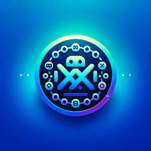

  

xxtui，仅需一个url，轻松实现推送提醒。支持将消息发送至微信公众号、企业微信群、钉钉群、Bark ~

  
  
  
  

## 🌟特点

- **简单**：一个url，仅需切换`专属KEY`，轻松实现各种渠道的通知
- **高效**：服务器接收即处理，无需等待，渠道组内包含多个渠道时采用多线程同时推送
- **专属KEY**：除主`KEY`默认用法，每个渠道、渠道组都有独立的`API_KEY`
- **聚合**：选择渠道生成组合，使用渠道组`API_KEY`可以同时推送消息到组合里的每个渠道

## 📡 支持渠道

- 📱 **微信公众号**

  通过公众号模板快速推送消息，直达用户微信端。

- 📨 **企业微信群**

  企业微信群机器人，消息可定向发送到指定群聊。

- 📩 **钉钉群**

  钉钉群机器人

- 🔔 **Bark**

  iOS 平台本地推送工具，配合 Bark APP 实时唤醒手机通知，适合个人任务提醒和轻量级消息推送。

- ⚙️ **自定义 HTTP 渠道**

  用户可按需配置任意 HTTP 接口，携带变量和自定义头部，自由扩展到更多系统或服务。

## 💡使用场景

- 👔 **工作协同**

  接收需求更新、审批完成等提醒，一键推送到团队群，及时跟进，不错过任何变动。

- 🍅 **番茄专注**

  每个 25 分钟工作／学习时段结束后，自动推送“休息开始”“休息结束”提醒，告别分心。

- 🎮 **监控告警**

  服务异常时，立即将报警发送到微信、钉钉等多个群组，运维团队秒响应，减少故障损失。

- ⏰ **定时提醒**

  设定日常打卡、吃药、账单到期等定时任务，让 xxtui 成为你的贴身小助手。

## 💭社区

火速赶来中~
 
## 💖支持

如果您喜欢本项目，欢迎star。您的支持是我持续更新的动力 ദ്ദി˶>𖥦<)✧Thanks!

## ⭐Star History

---

Made with ❤️ & ⌨️

